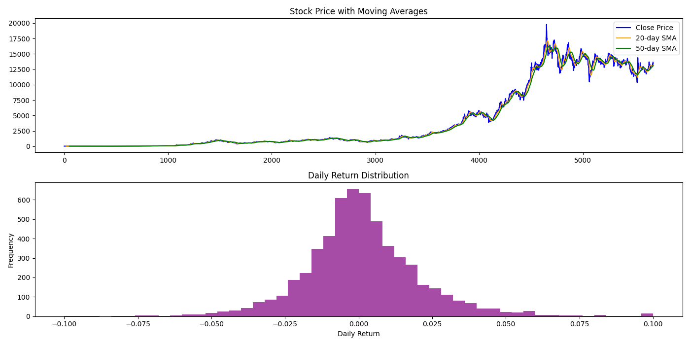
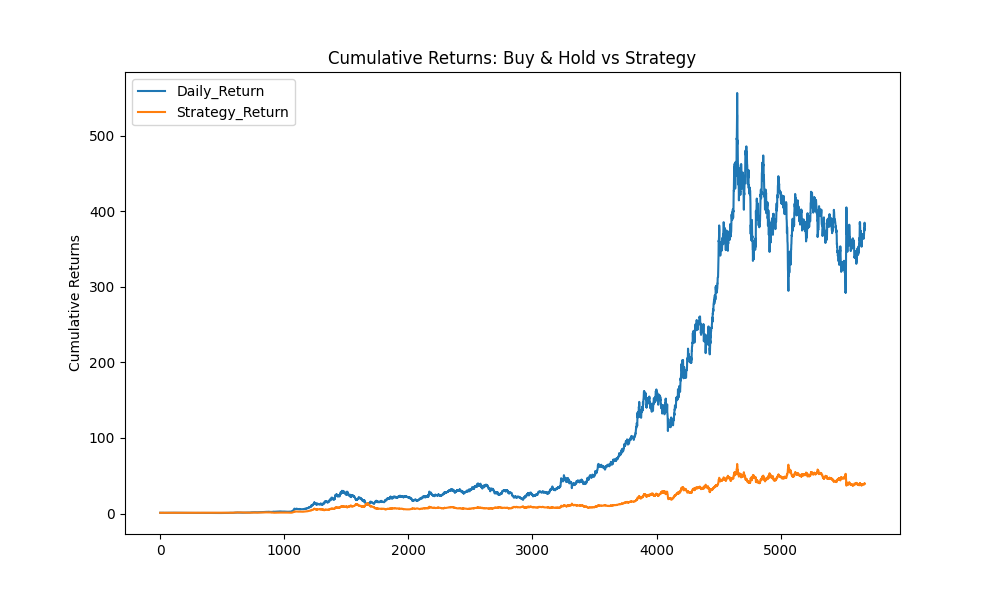

# 股票分析与策略开发

本项目使用 Python 和 AkShare 库获取贵州茅台（股票代码：sh600519）的历史数据，并进行技术分析和策略回测。

## 功能概述

- **数据获取**: 获取复权后的 A 股历史数据。
- **数据预处理**: 检查并处理缺失值，计算每日涨跌幅、简单移动平均线等指标。
- **技术分析**: 包括波动性分析、RSI 指标计算、均线交叉策略等。
- **可视化**: 展示股价走势、每日收益率分布以及累计收益对比。

## 安装依赖

确保安装以下库：
bash pip install akshare matplotlib pandas numpy

## 使用方法

运行 Jupyter Notebook 文件以查看完整的分析流程。

## 示例图表

1. **股价与均线** **每日收益率分布**:
   

2. **累计收益对比**:
   

## 贡献

欢迎提交 PR 或报告问题！

## 许可证

本项目采用 MIT 许可证。详情见 [LICENSE](LICENSE) 文件。